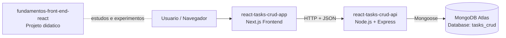

# UNIPDS Front-End com React

Repositorio com tres projetos relacionados ao modulo de estudos em React, Next.js e integracao com APIs.

## Projetos no diretorio

1. [fundamentos-front-end-react](fundamentos-front-end-react)
Projeto de estudos com aulas praticas de fundamentos, renderizacao, contexto, autenticacao e chamadas de API no Next.js.

2. [react-tasks-crud-app](react-tasks-crud-app)
Frontend da aplicacao Tasks CRUD com cadastro, login e area protegida de tarefas usando JWT.

3. [react-tasks-crud-api](react-tasks-crud-api)
API REST de autenticacao e tarefas (CRUD), integrada ao MongoDB Atlas.

## Como os projetos se conectam

- `react-tasks-crud-app` consome a API do `react-tasks-crud-api` em `http://localhost:3001`.
- `react-tasks-crud-api` persiste dados no MongoDB (Atlas no cenario padronizado).
- `fundamentos-front-end-react` e um projeto de apoio didatico, independente do CRUD.

## Resumo de cada projeto

### 1) fundamentos-front-end-react

- Foco: fundamentos de React/Next em aulas progressivas.
- Destaques: contexto global, paginas client/server, rotas protegidas e exemplos de API.
- Principais libs: Next.js 16, React 19, SWR, JOSE, js-cookie, Tailwind CSS, TypeScript.

### 2) react-tasks-crud-app

- Foco: interface web do sistema de tarefas.
- Destaques: cadastro/login, middleware de protecao, gerenciamento de sessao via cookie JWT e CRUD de tarefas.
- Principais libs: Next.js 15, React 19, JOSE, classnames, Tailwind CSS, TypeScript.

### 3) react-tasks-crud-api

- Foco: backend REST para autenticacao e tarefas.
- Destaques: endpoints `/auth/*` e `/tasks/*`, validacao de token e integracao com MongoDB Atlas.
- Principais libs: Node.js, Express 5, Mongoose, jsonwebtoken, bcryptjs, dotenv, cors, nodemon.

## Tecnologias usadas (icones + descricao)

| Tecnologia | Icone | O que faz |
|---|---|---|
| Next.js |  | Framework React para renderizacao hibrida (SSR/SSG), roteamento e backend routes. |
| React |  | Biblioteca para construir interfaces componentizadas e reativas. |
| TypeScript |  | Tipagem estatica para aumentar seguranca e manutencao do codigo JavaScript. |
| Tailwind CSS |  | Framework CSS utilitario para criar layouts rapidos e consistentes. |
| SWR |  | Estrategia de cache e revalidacao para busca de dados no frontend. |
| Node.js |  | Runtime JavaScript no servidor para executar APIs e scripts. |
| Express |  | Framework web minimalista para criar APIs REST em Node.js. |
| MongoDB |  | Banco NoSQL orientado a documentos para persistencia de dados. |
| Mongoose |  | ODM para modelagem, validacao e acesso ao MongoDB em Node.js. |
| JWT (jsonwebtoken / jose) |  | Padrao de token para autenticacao stateless entre frontend e backend. |
| bcryptjs |  | Hash seguro de senhas antes de salvar no banco. |
| ESLint |  | Analise estatica para padrao de codigo e prevencao de erros comuns. |

## Arquitetura (visao geral)



## Demonstracao visual

### Tasks CRUD

- Tela de cadastro e login com JWT
- Lista de tarefas com criacao, conclusao e exclusao
- Integracao com API e persistencia no MongoDB Atlas

Sugestao para enriquecer este README com imagens:

1. Criar pasta `docs/assets` na raiz
2. Salvar capturas da aplicacao (ex.: `tasks-login.png`, `tasks-list.png`)
3. Incluir no README usando Markdown:

```md


```

## Execucao rapida (Tasks CRUD)

1. Subir API
- Entre em [react-tasks-crud-api](react-tasks-crud-api)
- Configure `.env`
- Rode `npm install` e `npm run start`

2. Subir frontend
- Entre em [react-tasks-crud-app](react-tasks-crud-app)
- Configure `.env.local`
- Rode `npm install` e `npm run dev`

3. Acessar
- Frontend: `http://localhost:3000`
- API: `http://localhost:3001`
